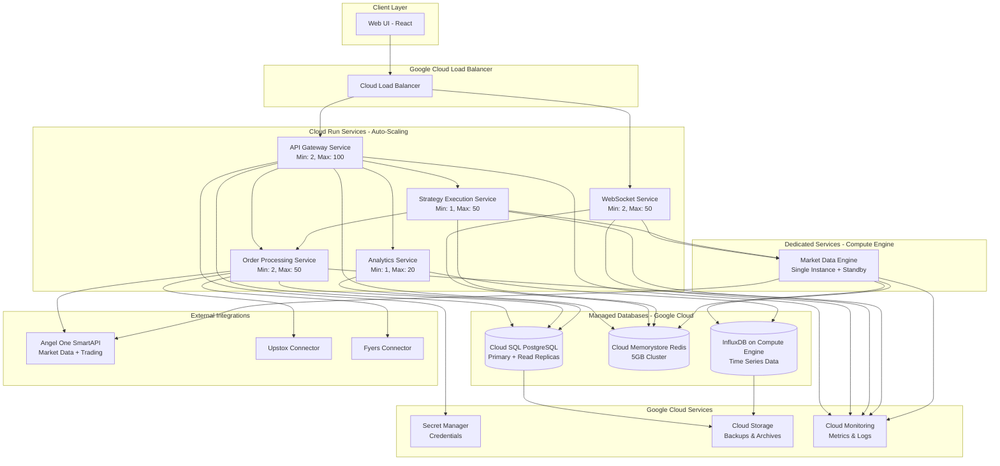

# Design Document

## Overview

The Multi-User Algorithmic Trading Platform is a comprehensive system for automated trading on the National Stock Exchange (NSE) of India. The platform supports multiple user roles (Admin, Trader, Investor), multi-broker connectivity, real-time tick-by-tick data processing, multi-timeframe strategy execution, and comprehensive analytics.

### Key Design Principles

1. **Modularity**: Broker connectors and strategy modules are plug-and-play components
2. **Performance**: Sub-second latency for order execution and data processing
3. **Scalability**: Support for multiple concurrent users and strategies
4. **Security**: Role-based access control, encrypted credentials, and audit trails
5. **Reliability**: Fault tolerance with automatic reconnection and error isolation

### Technology Stack

- **Backend**: Flask (Python) for backend services with async support via Flask-SocketIO
- **Database**: PostgreSQL for relational data, Redis for real-time caching
- **Message Queue**: Celery with Redis/RabbitMQ for background tasks and event processing
- **WebSocket**: Flask-SocketIO for real-time client updates
- **Frontend**: React with TypeScript for responsive UI
- **Real-time Charting**: TradingView Lightweight Charts for live candlestick charts with tick-by-tick updates
- **Performance Visualization**: Plotly.js for analytics charts and equity curves
- **Data Processing**: Pandas and NumPy for efficient market data and indicator calculations
- **Time Series**: InfluxDB for storing historical candle data
- **Cloud Platform**: Google Cloud Run for containerized microservices deployment
- **Load Balancing**: Google Cloud Load Balancer for distributing traffic
- **Container Registry**: Google Artifact Registry for Docker images
- **Secrets Management**: Google Secret Manager for API keys and credentials
- **Monitoring**: Google Cloud Monitoring and Logging for observability

**Design Rationale**: Google Cloud Run provides automatic scaling, pay-per-use pricing, and managed infrastructure. The serverless container platform can handle 500+ concurrent users by automatically scaling instances based on load. This ensures cost efficiency during low-traffic periods while maintaining performance during peak usage.

## Architecture

### High-Level Architecture (Google Cloud Run Deployment)



### System Flow

1. **Market Data Flow**: NSE Feed → Market Data Engine → Time Series DB/Cache → Strategy Engine
2. **Strategy Execution Flow**: Strategy Engine → Order Router → Broker Connector → Exchange
3. **User Interaction Flow**: Web UI → API Gateway → Services → Database
4. **Real-time Updates Flow**: Event → Message Queue → WebSocket Gateway → Web UI


## Components and Interfaces

### 1. Authentication Service

**Responsibility**: User authentication, authorization, and session management

**Key Methods**:
- `register(email, password, role)`: Create new user account with role
- `login(email, password)`: Authenticate and create session
- `validateSession(token)`: Verify active session and check inactivity timeout
- `refreshSession(token)`: Update last activity timestamp
- `logout(token)`: Terminate session
- `lockAccount(userId)`: Lock account after failed attempts
- `unlockAccount(userId)`: Unlock account (admin only or after timeout)

**Session Management**:
- JWT tokens expire after 24 hours
- Sessions automatically timeout after 30 minutes of inactivity
- Each API request updates the last_activity timestamp
- Background job checks for inactive sessions every 5 minutes
- Expired sessions are automatically cleaned up

**Account Locking**:
- Account locks after 3 consecutive failed login attempts
- Locked accounts automatically unlock after 15 minutes
- Admin users can manually unlock accounts
- All lock/unlock events are logged in audit trail

**Design Rationale**: The session timeout mechanism protects against unauthorized access from unattended sessions. Account locking prevents brute-force attacks while the automatic unlock prevents permanent lockouts from legitimate users. This addresses Requirement 1 security requirements.

**Data Models**:
```python
from dataclasses import dataclass
from datetime import datetime
from enum import Enum

class UserRole(Enum):
    ADMIN = "admin"
    TRADER = "trader"
    INVESTOR = "investor"

@dataclass
class User:
    id: str
    email: str
    password_hash: str
    role: UserRole
    account_id: str
    created_at: datetime
    is_locked: bool
    failed_login_attempts: int

@dataclass
class Session:
    token: str
    user_id: str
    created_at: datetime
    expires_at: datetime
    last_activity: datetime
    ip_address: str
    user_agent: str
```

### 2. User Management Service

**Responsibility**: Manage user accounts, roles, and investor invitations

**Key Methods**:
- `createUserAccount(traderId)`: Create trading account for trader
- `inviteInvestor(accountId, investorEmail)`: Invite investor to view account
- `acceptInvitation(invitationId, userId)`: Accept investor invitation
- `revokeInvestorAccess(accountId, investorId)`: Remove investor from account
- `getAccountUsers(accountId)`: Get all users for an account
- `getInvestorAccounts(investorId)`: Get all accounts an investor can view
- `updateUserRole(userId, newRole)`: Update user role (admin only)
- `disableUser(userId)`: Disable user account

**Multi-User Account Sharing Flow**:
1. Trader creates a User Account (automatically granted 'trader' role for that account)
2. Trader invites Investor by email (creates InvestorInvitation with 7-day expiration)
3. Investor receives email with invitation link
4. Investor accepts invitation (creates AccountAccess record with 'investor' role)
5. Investor can now view all trading activity, positions, and analytics for that account
6. Investor has read-only access (cannot modify strategies, execute trades, or change settings)
7. Trader can revoke investor access at any time

**Design Rationale**: This multi-user model allows traders to transparently share their trading performance with investors without giving them control over trading operations. The invitation system with expiration ensures secure access management. This addresses Requirement 1 and Requirement 14.

**Data Models**:
```python
@dataclass
class UserAccount:
    id: str
    trader_id: str
    name: str
    created_at: datetime
    is_active: bool

@dataclass
class AccountAccess:
    account_id: str
    user_id: str
    role: str  # 'trader' or 'investor'
    granted_at: datetime

@dataclass
class InvestorInvitation:
    id: str
    account_id: str
    inviter_id: str
    invitee_email: str
    status: str  # 'pending', 'accepted', 'rejected', 'expired'
    created_at: datetime
    expires_at: datetime
```


### 3. Market Data Engine

**Responsibility**: Receive tick data, maintain candles, calculate indicators

**Key Methods**:
- `subscribe(symbol, timeframes[])`: Subscribe to market data
- `onTick(symbol, tick)`: Process incoming tick data
- `updateFormingCandles(symbol, tick)`: Update incomplete candles
- `getHistoricalCandles(symbol, timeframe, count)`: Retrieve historical data
- `getFormingCandle(symbol, timeframe)`: Get current incomplete candle
- `calculateIndicator(symbol, timeframe, indicatorType, params)`: Calculate indicator values

**Data Models**:
```python
from typing import Union, List

@dataclass
class Tick:
    symbol: str
    price: float
    volume: int
    timestamp: datetime

@dataclass
class Candle:
    symbol: str
    timeframe: str  # '1m', '5m', '15m', '1h', '1d'
    open: float
    high: float
    low: float
    close: float
    volume: int
    timestamp: datetime
    is_forming: bool

@dataclass
class IndicatorValue:
    symbol: str
    timeframe: str
    indicator_type: str
    value: Union[float, List[float]]
    timestamp: datetime
```

**Candle Management Strategy**:
- Maintain in-memory buffer of last 500 candles per timeframe per symbol
- Store completed candles in InfluxDB for historical queries
- Update forming candles in Redis for fast access
- Trigger candle completion events when timeframe period ends


### 4. Strategy Execution Engine

**Responsibility**: Execute strategy logic, manage multi-timeframe analysis

**Key Methods**:
- `loadStrategy(strategyId, config)`: Load and initialize strategy
- `executeStrategy(strategyId, marketData)`: Run strategy logic
- `pauseStrategy(strategyId)`: Pause strategy execution
- `resumeStrategy(strategyId)`: Resume paused strategy
- `getStrategyState(strategyId)`: Get current strategy state

**Strategy Module Interface**:
```python
from abc import ABC, abstractmethod
from typing import Optional, Dict, List, Any

class IStrategy(ABC):
    @abstractmethod
    def initialize(self, config: 'StrategyConfig') -> None:
        pass
    
    @abstractmethod
    def on_tick(self, data: 'MultiTimeframeData') -> Optional['Signal']:
        pass
    
    @abstractmethod
    def on_candle_complete(self, timeframe: str, candle: Candle) -> Optional['Signal']:
        pass
    
    @abstractmethod
    def cleanup(self) -> None:
        pass

@dataclass
class StrategyConfig:
    strategy_id: str
    account_id: str
    trading_mode: str  # 'paper' or 'live'
    symbols: List[str]
    timeframes: List[str]
    parameters: Dict[str, Any]
    risk_management: 'RiskConfig'

@dataclass
class TimeframeData:
    historical_candles: List[Candle]
    forming_candle: Candle
    indicators: Dict[str, IndicatorValue]

@dataclass
class MultiTimeframeData:
    symbol: str
    timeframes: Dict[str, TimeframeData]

@dataclass
class Signal:
    type: str  # 'entry' or 'exit'
    direction: str  # 'long' or 'short'
    symbol: str
    quantity: int
    order_type: str  # 'market' or 'limit'
    price: Optional[float] = None
    stop_loss: Optional[float] = None
    take_profit: Optional[float] = None
    trailing_stop_loss: Optional[float] = None
```

**Execution Flow**:
1. On tick arrival: Update all timeframe candles → Recalculate indicators → Execute strategy.onTick()
2. On candle completion: Execute strategy.onCandleComplete() for that timeframe
3. If signal generated: Validate signal → Send to Order Router
4. Handle errors: Log error → Pause strategy → Notify user


### 5. Symbol Mapping Service

**Responsibility**: Translate between standard NSE symbols and broker-specific symbol tokens

**Key Methods**:
- `getStandardSymbol(brokerName, brokerSymbol)`: Convert broker symbol to standard symbol
- `getBrokerSymbol(brokerName, standardSymbol)`: Convert standard symbol to broker-specific format
- `loadSymbolMapping(brokerName, mappingFile)`: Load symbol mapping from CSV
- `validateSymbol(standardSymbol)`: Check if symbol exists in mapping
- `getAllMappings(brokerName)`: Get all symbol mappings for a broker

**Data Models**:
```python
@dataclass
class SymbolMapping:
    standard_symbol: str
    broker_name: str
    broker_symbol: str
    broker_token: str
    exchange: str  # 'NSE', 'BSE', 'NFO'
    instrument_type: str  # 'EQ', 'FUT', 'OPT'
    lot_size: int
    tick_size: float

@dataclass
class SymbolMappingCache:
    mappings: Dict[str, Dict[str, SymbolMapping]]  # {broker_name: {standard_symbol: mapping}}
    last_updated: datetime
```

**Symbol Translation Flow**:
1. Strategy generates signal with standard symbol (e.g., "RELIANCE")
2. Order Router calls `getBrokerSymbol("Angel One", "RELIANCE")`
3. Service returns broker-specific token (e.g., "2885")
4. Order submitted to broker with correct token
5. Broker response contains broker token
6. Service translates back to standard symbol for display

**CSV Format for Symbol Mapping**:
```csv
standard_symbol,broker_symbol,broker_token,exchange,instrument_type,lot_size,tick_size
RELIANCE,RELIANCE-EQ,2885,NSE,EQ,1,0.05
TCS,TCS-EQ,11536,NSE,EQ,1,0.05
INFY,INFY-EQ,1594,NSE,EQ,1,0.05
NIFTY50,NIFTY,99926000,NSE,INDEX,1,0.05
```

**Design Rationale**: Different brokers use different symbol formats and tokens. Centralizing symbol mapping allows strategies to use standard symbols while the platform handles broker-specific translations. This enables users to switch brokers without modifying strategies. This addresses Requirement 13.


### 6. Risk Management Service

**Responsibility**: Monitor losses and enforce maximum loss limits

**Key Methods**:
- `setMaxLossLimit(accountId, tradingMode, limitAmount)`: Set maximum loss limit in rupees
- `calculateCurrentLoss(accountId, tradingMode)`: Calculate total realized + unrealized loss
- `checkLossLimit(accountId, tradingMode)`: Check if loss limit is breached
- `pauseAllStrategies(accountId, reason)`: Pause all strategies for an account
- `acknowledgeLimit Breach(accountId, newLimit)`: Allow user to acknowledge and update limit

**Data Models**:
```python
@dataclass
class RiskLimits:
    account_id: str
    trading_mode: str  # 'paper' or 'live'
    max_loss_limit: float  # in rupees
    current_loss: float
    is_breached: bool
    breached_at: Optional[datetime]
    acknowledged: bool

@dataclass
class LossCalculation:
    realized_loss: float
    unrealized_loss: float
    total_loss: float
    timestamp: datetime
```

**Loss Monitoring Flow**:
1. User sets max loss limit when activating first strategy
2. On every position update: Calculate total loss (realized + unrealized)
3. If total loss >= max loss limit:
   - Set is_breached = True
   - Pause all active strategies immediately
   - Send urgent notification to user
   - Prevent new strategy activation
4. User must acknowledge breach and either:
   - Increase the limit
   - Accept current limit and resume
5. Track separately for paper and live trading

**Design Rationale**: Maximum loss limits protect users from catastrophic losses. Real-time monitoring ensures limits are enforced immediately. Separate limits for paper and live trading allow different risk tolerances. This addresses Requirement 8.

### 7. Concurrent Strategy Limit Manager

**Responsibility**: Enforce admin-configured limits on concurrent strategy execution

**Key Methods**:
- `setGlobalLimit(tradingMode, maxStrategies)`: Admin sets global limit
- `getActiveStrategyCount(accountId, tradingMode)`: Count running strategies
- `canActivateStrategy(accountId, tradingMode)`: Check if activation is allowed
- `enforceLimit(accountId, tradingMode)`: Validate before strategy activation

**Data Models**:
```python
@dataclass
class StrategyLimits:
    trading_mode: str  # 'paper' or 'live'
    max_concurrent_strategies: int
    current_active_count: int
    last_updated: datetime
    updated_by: str  # admin user id

@dataclass
class AccountStrategyCount:
    account_id: str
    trading_mode: str
    active_strategies: int
    paused_strategies: int
```

**Limit Enforcement Flow**:
1. Admin configures global limit (e.g., 5 strategies per user)
2. User attempts to activate strategy
3. System checks: active_count < max_limit
4. If limit reached: Reject activation with error message
5. If under limit: Allow activation
6. Display current count and limit on UI

**Design Rationale**: Limiting concurrent strategies prevents system overload and ensures fair resource allocation. Admin control allows platform scaling based on infrastructure capacity. Separate limits for paper and live trading enable different resource allocation strategies. This addresses Requirement 12.

### 8. Order Router and Management

**Responsibility**: Route orders to brokers, track order lifecycle, simulate paper trading

**Key Methods**:
- `submitOrder(order, tradingMode)`: Submit order (live or paper)
- `cancelOrder(orderId)`: Cancel pending order
- `modifyOrder(orderId, updates)`: Modify order parameters
- `getOrderStatus(orderId)`: Query order status
- `simulatePaperOrder(order)`: Simulate order execution

**Data Models**:
```python
@dataclass
class Order:
    id: str
    account_id: str
    strategy_id: str
    symbol: str
    side: str  # 'buy' or 'sell'
    quantity: int
    order_type: str  # 'market', 'limit', 'stop', 'stop_limit'
    price: Optional[float]
    stop_price: Optional[float]
    trading_mode: str  # 'paper' or 'live'
    status: str  # 'pending', 'submitted', 'partial', 'filled', 'cancelled', 'rejected'
    filled_quantity: int
    average_price: float
    created_at: datetime
    updated_at: datetime
    broker_id: Optional[str] = None
    broker_order_id: Optional[str] = None

@dataclass
class Trade:
    id: str
    order_id: str
    account_id: str
    symbol: str
    side: str  # 'buy' or 'sell'
    quantity: int
    price: float
    commission: float
    trading_mode: str  # 'paper' or 'live'
    executed_at: datetime
```

**Paper Trading Simulation**:
- Use current market price for market orders
- Use limit price for limit orders (fill when market reaches price)
- Apply configurable slippage (default 0.05%)
- Apply configurable commission (default 0.03%)
- Update simulated positions immediately
- No actual broker communication
- Maintain separate order and position tracking for paper vs live modes
- Simulate realistic order fills based on market depth (when available)
- Track paper trading performance independently from live trading

**Design Rationale**: Paper trading provides a risk-free environment for strategy validation before committing real capital. By simulating realistic market conditions including slippage and commissions, users can get accurate performance estimates. The separation of paper and live trading data ensures users can clearly distinguish between simulated and real results, addressing Requirement 3 and Requirement 10.


### 9. Position Manager

**Responsibility**: Track positions, calculate P&L, manage trailing stop-loss

**Key Methods**:
- `openPosition(trade)`: Create new position from trade
- `updatePosition(positionId, trade)`: Update position with new trade
- `closePosition(positionId)`: Close position
- `getPositions(accountId, tradingMode)`: Get all positions
- `calculatePnL(positionId, currentPrice)`: Calculate unrealized P&L
- `updateTrailingStopLoss(positionId, currentPrice)`: Update trailing stop

**Data Models**:
```python
@dataclass
class TrailingStopConfig:
    enabled: bool
    percentage: float
    current_stop_price: float
    highest_price: float  # for long positions
    lowest_price: float   # for short positions

@dataclass
class Position:
    id: str
    account_id: str
    strategy_id: str
    symbol: str
    side: str  # 'long' or 'short'
    quantity: int
    entry_price: float
    current_price: float
    unrealized_pnl: float
    realized_pnl: float
    trading_mode: str  # 'paper' or 'live'
    stop_loss: Optional[float]
    take_profit: Optional[float]
    trailing_stop_loss: Optional[TrailingStopConfig]
    opened_at: datetime
    closed_at: Optional[datetime] = None
```

**Trailing Stop-Loss Logic**:
- For long positions: Stop price = max(highestPrice * (1 - percentage), currentStopPrice)
- For short positions: Stop price = min(lowestPrice * (1 + percentage), currentStopPrice)
- Check on every tick update
- Trigger exit order when current price <= stop price (long) or >= stop price (short)


### 10. Broker Connector Interface

**Responsibility**: Standardized interface for broker integrations

**Interface Definition**:
```python
from abc import ABC, abstractmethod
from typing import Callable

@dataclass
class BrokerCredentials:
    api_key: str
    api_secret: str
    user_id: Optional[str] = None
    additional_params: Optional[Dict[str, str]] = None

@dataclass
class BrokerOrder:
    symbol: str
    side: str  # 'buy' or 'sell'
    quantity: int
    order_type: str  # 'market', 'limit', 'stop', 'stop_limit'
    price: Optional[float] = None
    stop_price: Optional[float] = None
    product_type: str = 'intraday'  # 'intraday' or 'delivery'

@dataclass
class BrokerOrderResponse:
    broker_order_id: str
    status: str
    message: Optional[str] = None

class IBrokerConnector(ABC):
    @abstractmethod
    def connect(self, credentials: BrokerCredentials) -> None:
        pass
    
    @abstractmethod
    def disconnect(self) -> None:
        pass
    
    @abstractmethod
    def is_connected(self) -> bool:
        pass
    
    @abstractmethod
    def place_order(self, order: BrokerOrder) -> BrokerOrderResponse:
        pass
    
    @abstractmethod
    def cancel_order(self, broker_order_id: str) -> None:
        pass
    
    @abstractmethod
    def modify_order(self, broker_order_id: str, updates: Dict[str, Any]) -> None:
        pass
    
    @abstractmethod
    def get_order_status(self, broker_order_id: str) -> str:
        pass
    
    @abstractmethod
    def get_positions(self) -> List['BrokerPosition']:
        pass
    
    @abstractmethod
    def get_account_info(self) -> 'AccountInfo':
        pass
    
    @abstractmethod
    def on_order_update(self, callback: Callable) -> None:
        pass
    
    @abstractmethod
    def on_connection_lost(self, callback: Callable) -> None:
        pass
```

**Supported Brokers** (Initial Implementation):
1. Zerodha (Kite Connect API)
2. Angel One (SmartAPI)
3. Upstox (API v2)

**Reconnection Strategy**:
- Attempt reconnection every 30 seconds
- Maximum 10 attempts (5 minutes)
- Pause all strategies during disconnection
- Resume strategies after successful reconnection
- Notify user of connection status changes


### 11. Backtesting Engine

**Responsibility**: Execute strategies against historical data, generate performance reports

**Key Methods**:
- `runBacktest(config: BacktestConfig)`: Execute backtest
- `simulateOrder(order, currentCandle)`: Simulate order execution
- `calculateMetrics(trades)`: Calculate performance metrics
- `generateReport(backtestId)`: Generate detailed report

**Data Models**:
```python
@dataclass
class BacktestConfig:
    strategy_id: str
    symbols: List[str]
    timeframes: List[str]
    start_date: datetime
    end_date: datetime
    initial_capital: float
    slippage: float
    commission: float

@dataclass
class PerformanceMetrics:
    total_return: float
    annualized_return: float
    max_drawdown: float
    sharpe_ratio: float
    sortino_ratio: float
    win_rate: float
    profit_factor: float
    average_win: float
    average_loss: float
    total_trades: int
    winning_trades: int
    losing_trades: int

@dataclass
class BacktestTrade:
    entry_date: datetime
    exit_date: datetime
    symbol: str
    side: str  # 'long' or 'short'
    entry_price: float
    exit_price: float
    quantity: int
    pnl: float
    pnl_percent: float
    commission: float

@dataclass
class EquityPoint:
    timestamp: datetime
    equity: float
    drawdown: float

@dataclass
class BacktestResult:
    id: str
    config: BacktestConfig
    metrics: PerformanceMetrics
    trades: List[BacktestTrade]
    equity_curve: List[EquityPoint]
    completed_at: datetime
```

**Execution Process**:
1. Load historical data for all symbols and timeframes
2. Initialize strategy with config
3. Iterate through time chronologically
4. For each tick: Update candles → Calculate indicators → Execute strategy
5. Simulate order fills with slippage and commission
6. Track positions and equity
7. Calculate metrics and generate report


### 12. Analytics Service

**Responsibility**: Calculate performance metrics, generate reports and charts

**Key Methods**:
- `getPerformanceMetrics(accountId, tradingMode, period)`: Get metrics for period
- `getEquityCurve(accountId, tradingMode, startDate, endDate)`: Get equity curve data
- `getStrategyBreakdown(accountId, tradingMode)`: Get per-strategy performance by trading mode
- `getTradeAnalysis(accountId, tradingMode)`: Get detailed trade statistics
- `exportReport(accountId, tradingMode, format)`: Export report as PDF or CSV
- `compareToBenchmark(accountId, benchmarkIndex)`: Compare to NSE indices (NIFTY 50, BANK NIFTY)
- `getRiskMetrics(accountId, tradingMode)`: Calculate VaR, beta, correlation
- `getDrawdownAnalysis(accountId, tradingMode)`: Analyze drawdown periods and recovery times

**Design Rationale**: Comprehensive analytics enable users to evaluate strategy performance objectively. Separate metrics for paper and live trading allow users to compare simulated vs actual results. Advanced metrics like Sharpe ratio and Sortino ratio provide risk-adjusted performance measures. Benchmark comparison helps users understand performance relative to market indices. This addresses Requirement 15.

**Data Models**:
```python
@dataclass
class AnalyticsPeriod:
    period: str  # 'daily', 'weekly', 'monthly', 'yearly', 'all'
    start_date: datetime
    end_date: datetime

@dataclass
class StrategyPerformance:
    strategy_id: str
    strategy_name: str
    total_return: float
    win_rate: float
    total_trades: int
    profit_factor: float

@dataclass
class RiskMetrics:
    total_exposure: float
    margin_utilization: float
    value_at_risk: float
    beta: float
    correlation: float

@dataclass
class PerformanceSummary:
    account_id: str
    trading_mode: str  # 'paper' or 'live'
    period: AnalyticsPeriod
    metrics: PerformanceMetrics
    strategy_breakdown: List[StrategyPerformance]
    risk_metrics: RiskMetrics

@dataclass
class ProfitByTime:
    hour: int
    profit: float

@dataclass
class ProfitByDay:
    day: str
    profit: float

@dataclass
class TradeStatistics:
    average_holding_time: float
    best_trade: BacktestTrade
    worst_trade: BacktestTrade
    consecutive_wins: int
    consecutive_losses: int
    profit_by_time_of_day: List[ProfitByTime]
    profit_by_day_of_week: List[ProfitByDay]
```

**Chart Generation**:
- Equity curve: Line chart of portfolio value over time
- Drawdown chart: Area chart showing drawdown periods
- Win/Loss distribution: Histogram of trade P&L
- Profit by time: Heatmap of profitability by hour/day
- Strategy comparison: Bar chart comparing strategy performance


### 13. Notification Service

**Responsibility**: Send notifications through multiple channels

**Key Methods**:
- `sendNotification(userId, notification)`: Send notification to user
- `configurePreferences(userId, preferences)`: Set notification preferences
- `getNotificationHistory(userId)`: Get past notifications

**Data Models**:
```python
@dataclass
class Notification:
    id: str
    user_id: str
    type: str  # 'order_executed', 'strategy_error', 'threshold_alert', 'connection_lost', 'system_alert'
    title: str
    message: str
    severity: str  # 'info', 'warning', 'error'
    channels: List[str]  # 'email', 'sms', 'in_app'
    created_at: datetime
    read_at: Optional[datetime] = None

@dataclass
class NotificationChannelConfig:
    enabled: bool
    channels: List[str]

@dataclass
class NotificationPreferences:
    user_id: str
    preferences: Dict[str, NotificationChannelConfig]
```

**Notification Triggers**:
- Order executed: When order fills (both paper and live modes)
- Strategy error: When strategy throws exception
- Threshold alert: When position P&L reaches configured threshold
- Connection lost: When broker or market data connection drops
- System alert: Admin alerts for system issues
- Trailing stop triggered: When trailing stop-loss executes
- Investor invitation: When trader invites investor to view account
- Account access granted: When investor accepts invitation
- Session timeout warning: 5 minutes before automatic logout
- Account locked: When account is locked due to failed login attempts

**Design Rationale**: Comprehensive notifications keep users informed of critical events without requiring constant monitoring. The multi-channel approach ensures users receive alerts through their preferred medium. Separate notifications for paper and live trading help users distinguish between simulation and real trading. This addresses Requirement 6.

**Delivery Channels**:
- In-app: WebSocket push to connected clients (real-time, < 500ms)
- Email: SMTP integration (for non-urgent notifications and invitations)
- SMS: Twilio or similar SMS gateway (for critical alerts only)

**Channel Selection Logic**:
- Critical events (connection lost, large losses): All enabled channels
- Important events (order executed, strategy error): In-app + Email
- Informational events (threshold alerts): In-app only
- User can customize channel preferences per notification type


## Data Models

### Database Schema (PostgreSQL)

```sql
-- Users and Authentication
CREATE TABLE users (
  id UUID PRIMARY KEY,
  email VARCHAR(255) UNIQUE NOT NULL,
  password_hash VARCHAR(255) NOT NULL,
  role VARCHAR(20) NOT NULL CHECK (role IN ('admin', 'trader', 'investor')),
  is_locked BOOLEAN DEFAULT FALSE,
  failed_login_attempts INT DEFAULT 0,
  created_at TIMESTAMP DEFAULT NOW()
);

CREATE TABLE user_accounts (
  id UUID PRIMARY KEY,
  trader_id UUID REFERENCES users(id),
  name VARCHAR(255) NOT NULL,
  is_active BOOLEAN DEFAULT TRUE,
  created_at TIMESTAMP DEFAULT NOW()
);

CREATE TABLE account_access (
  account_id UUID REFERENCES user_accounts(id),
  user_id UUID REFERENCES users(id),
  role VARCHAR(20) NOT NULL CHECK (role IN ('trader', 'investor')),
  granted_at TIMESTAMP DEFAULT NOW(),
  PRIMARY KEY (account_id, user_id)
);

CREATE TABLE investor_invitations (
  id UUID PRIMARY KEY,
  account_id UUID REFERENCES user_accounts(id),
  inviter_id UUID REFERENCES users(id),
  invitee_email VARCHAR(255) NOT NULL,
  status VARCHAR(20) NOT NULL CHECK (status IN ('pending', 'accepted', 'rejected', 'expired')),
  created_at TIMESTAMP DEFAULT NOW(),
  expires_at TIMESTAMP NOT NULL,
  accepted_at TIMESTAMP
);

CREATE TABLE sessions (
  token VARCHAR(512) PRIMARY KEY,
  user_id UUID REFERENCES users(id),
  created_at TIMESTAMP DEFAULT NOW(),
  expires_at TIMESTAMP NOT NULL,
  last_activity TIMESTAMP DEFAULT NOW(),
  ip_address VARCHAR(45),
  user_agent TEXT
);

CREATE INDEX idx_sessions_user ON sessions(user_id, last_activity DESC);
CREATE INDEX idx_sessions_expiry ON sessions(expires_at);
CREATE INDEX idx_invitations_email ON investor_invitations(invitee_email, status);

-- Broker Connections
CREATE TABLE broker_connections (
  id UUID PRIMARY KEY,
  account_id UUID REFERENCES user_accounts(id),
  broker_name VARCHAR(50) NOT NULL,
  credentials_encrypted TEXT NOT NULL,
  is_connected BOOLEAN DEFAULT FALSE,
  last_connected_at TIMESTAMP,
  created_at TIMESTAMP DEFAULT NOW()
);

-- Strategies (Pre-built only)
CREATE TABLE strategies (
  id UUID PRIMARY KEY,
  name VARCHAR(255) NOT NULL,
  description TEXT,
  strategy_type VARCHAR(50) NOT NULL CHECK (strategy_type IN ('pre_built')),
  config JSONB NOT NULL,
  is_public BOOLEAN DEFAULT TRUE,
  created_by UUID REFERENCES users(id),
  created_at TIMESTAMP DEFAULT NOW()
);

-- Risk Management
CREATE TABLE risk_limits (
  account_id UUID REFERENCES user_accounts(id),
  trading_mode VARCHAR(10) NOT NULL CHECK (trading_mode IN ('paper', 'live')),
  max_loss_limit DECIMAL(15, 2) NOT NULL,
  current_loss DECIMAL(15, 2) DEFAULT 0,
  is_breached BOOLEAN DEFAULT FALSE,
  breached_at TIMESTAMP,
  acknowledged BOOLEAN DEFAULT FALSE,
  updated_at TIMESTAMP DEFAULT NOW(),
  PRIMARY KEY (account_id, trading_mode)
);

-- Strategy Limits
CREATE TABLE strategy_limits (
  trading_mode VARCHAR(10) PRIMARY KEY CHECK (trading_mode IN ('paper', 'live')),
  max_concurrent_strategies INT NOT NULL DEFAULT 5,
  last_updated TIMESTAMP DEFAULT NOW(),
  updated_by UUID REFERENCES users(id)
);

-- Symbol Mapping
CREATE TABLE symbol_mappings (
  id UUID PRIMARY KEY,
  standard_symbol VARCHAR(50) NOT NULL,
  broker_name VARCHAR(50) NOT NULL,
  broker_symbol VARCHAR(100) NOT NULL,
  broker_token VARCHAR(100) NOT NULL,
  exchange VARCHAR(10) NOT NULL,
  instrument_type VARCHAR(10) NOT NULL,
  lot_size INT NOT NULL DEFAULT 1,
  tick_size DECIMAL(10, 4) NOT NULL DEFAULT 0.05,
  created_at TIMESTAMP DEFAULT NOW(),
  UNIQUE(broker_name, standard_symbol)
);

CREATE INDEX idx_symbol_mappings_broker ON symbol_mappings(broker_name, standard_symbol);
CREATE INDEX idx_symbol_mappings_token ON symbol_mappings(broker_name, broker_token);

CREATE TABLE active_strategies (
  id UUID PRIMARY KEY,
  account_id UUID REFERENCES user_accounts(id),
  strategy_id UUID REFERENCES strategies(id),
  trading_mode VARCHAR(10) NOT NULL CHECK (trading_mode IN ('paper', 'live')),
  status VARCHAR(20) NOT NULL CHECK (status IN ('running', 'paused', 'stopped', 'error')),
  config JSONB NOT NULL,
  started_at TIMESTAMP DEFAULT NOW(),
  stopped_at TIMESTAMP
);

-- Orders and Trades
CREATE TABLE orders (
  id UUID PRIMARY KEY,
  account_id UUID REFERENCES user_accounts(id),
  strategy_id UUID REFERENCES active_strategies(id),
  symbol VARCHAR(50) NOT NULL,
  side VARCHAR(10) NOT NULL CHECK (side IN ('buy', 'sell')),
  quantity INT NOT NULL,
  order_type VARCHAR(20) NOT NULL,
  price DECIMAL(10, 2),
  stop_price DECIMAL(10, 2),
  trading_mode VARCHAR(10) NOT NULL CHECK (trading_mode IN ('paper', 'live')),
  status VARCHAR(20) NOT NULL,
  filled_quantity INT DEFAULT 0,
  average_price DECIMAL(10, 2),
  broker_order_id VARCHAR(100),
  created_at TIMESTAMP DEFAULT NOW(),
  updated_at TIMESTAMP DEFAULT NOW()
);

CREATE TABLE trades (
  id UUID PRIMARY KEY,
  order_id UUID REFERENCES orders(id),
  account_id UUID REFERENCES user_accounts(id),
  symbol VARCHAR(50) NOT NULL,
  side VARCHAR(10) NOT NULL,
  quantity INT NOT NULL,
  price DECIMAL(10, 2) NOT NULL,
  commission DECIMAL(10, 2) NOT NULL,
  trading_mode VARCHAR(10) NOT NULL,
  executed_at TIMESTAMP DEFAULT NOW()
);

-- Positions
CREATE TABLE positions (
  id UUID PRIMARY KEY,
  account_id UUID REFERENCES user_accounts(id),
  strategy_id UUID REFERENCES active_strategies(id),
  symbol VARCHAR(50) NOT NULL,
  side VARCHAR(10) NOT NULL CHECK (side IN ('long', 'short')),
  quantity INT NOT NULL,
  entry_price DECIMAL(10, 2) NOT NULL,
  current_price DECIMAL(10, 2) NOT NULL,
  unrealized_pnl DECIMAL(10, 2) NOT NULL,
  realized_pnl DECIMAL(10, 2) DEFAULT 0,
  trading_mode VARCHAR(10) NOT NULL,
  stop_loss DECIMAL(10, 2),
  take_profit DECIMAL(10, 2),
  trailing_stop_config JSONB,
  opened_at TIMESTAMP DEFAULT NOW(),
  closed_at TIMESTAMP
);

-- Backtests
CREATE TABLE backtests (
  id UUID PRIMARY KEY,
  strategy_id UUID REFERENCES strategies(id),
  config JSONB NOT NULL,
  metrics JSONB NOT NULL,
  status VARCHAR(20) NOT NULL CHECK (status IN ('running', 'completed', 'failed')),
  created_at TIMESTAMP DEFAULT NOW(),
  completed_at TIMESTAMP
);

-- Notifications
CREATE TABLE notifications (
  id UUID PRIMARY KEY,
  user_id UUID REFERENCES users(id),
  type VARCHAR(50) NOT NULL,
  title VARCHAR(255) NOT NULL,
  message TEXT NOT NULL,
  severity VARCHAR(20) NOT NULL,
  read_at TIMESTAMP,
  created_at TIMESTAMP DEFAULT NOW()
);

CREATE INDEX idx_orders_account ON orders(account_id, created_at DESC);
CREATE INDEX idx_trades_account ON trades(account_id, executed_at DESC);
CREATE INDEX idx_positions_account ON positions(account_id, closed_at);
CREATE INDEX idx_notifications_user ON notifications(user_id, created_at DESC);
```


### Time Series Data (InfluxDB)

```
// Market data measurements
candles,symbol=RELIANCE,timeframe=1m open=2450.50,high=2451.20,low=2449.80,close=2450.90,volume=15000 1699350000000000000

indicators,symbol=RELIANCE,timeframe=5m,type=SMA,period=20 value=2448.75 1699350000000000000

// Performance tracking
equity,account_id=abc123,trading_mode=live value=1050000.00 1699350000000000000

drawdown,account_id=abc123,trading_mode=live value=-2.5 1699350000000000000
```

### Redis Cache Structure

```
// Forming candles (updated on every tick)
forming_candle:{symbol}:{timeframe} -> JSON(Candle)

// Active strategy states
strategy_state:{strategyId} -> JSON(StrategyState)

// Real-time positions
positions:{accountId}:{tradingMode} -> JSON(Position[])

// Market data subscriptions
subscriptions:{symbol} -> Set(strategyId)

// Session tokens
session:{token} -> JSON(Session)
```


## Error Handling

### Error Categories

1. **User Errors**: Invalid input, authentication failures
   - Response: Return 4xx HTTP status with error message
   - Action: Log warning, notify user

2. **System Errors**: Database failures, service unavailable
   - Response: Return 5xx HTTP status
   - Action: Log error, alert admin, attempt recovery

3. **Trading Errors**: Order rejection, broker connection loss
   - Response: Pause affected strategies
   - Action: Log error, notify user, attempt reconnection

4. **Strategy Errors**: Exception in strategy code
   - Response: Pause strategy, preserve state
   - Action: Log error with stack trace, notify user

### Error Recovery Strategies

**Broker Connection Loss**:
1. Detect disconnection
2. Pause all strategies using that broker
3. Attempt reconnection (30s intervals, 10 attempts)
4. If reconnection succeeds: Resume strategies
5. If reconnection fails: Notify user, require manual intervention

**Market Data Feed Loss**:
1. Detect disconnection
2. Pause all active strategies
3. Attempt reconnection immediately
4. Buffer missed data if possible
5. Resume strategies after reconnection and data sync

**Database Connection Loss**:
1. Use connection pooling with automatic retry
2. Queue critical operations (orders, trades)
3. Attempt reconnection with exponential backoff
4. If prolonged: Pause new operations, alert admin

**Strategy Execution Errors**:
1. Catch all exceptions in strategy code
2. Log error with full context (strategy ID, market data, stack trace)
3. Pause strategy to prevent repeated errors
4. Notify user with error details
5. Preserve strategy state for debugging


## Testing Strategy

### Unit Testing

**Components to Test**:
- Authentication Service: Login, registration, session management
- Market Data Engine: Candle formation, indicator calculation
- Strategy Engine: Signal generation, multi-timeframe logic
- Order Router: Order validation, paper trading simulation
- Position Manager: P&L calculation, trailing stop-loss logic
- Analytics Service: Metrics calculation, report generation

**Testing Approach**:
- Use pytest for Python testing
- Mock external dependencies (database, broker APIs) using unittest.mock
- Test edge cases (market gaps, connection losses)
- Aim for 80%+ code coverage on core logic

### Integration Testing

**Test Scenarios**:
1. End-to-end strategy execution: Market data → Strategy → Order → Position
2. Multi-timeframe data synchronization
3. Paper trading vs live trading mode switching
4. Broker connector integration with test accounts
5. Real-time WebSocket updates to clients
6. Backtest execution with historical data

**Testing Tools**:
- Flask test client for API testing
- Flask-SocketIO test client for WebSocket testing
- Docker containers for database integration tests

### Performance Testing

**Key Metrics**:
- Tick processing latency: < 50ms
- Indicator calculation time: < 100ms
- Order submission latency: < 200ms
- WebSocket update latency: < 500ms
- API response time (p95): < 1 second
- API response time (p99): < 2 seconds
- Concurrent user capacity: 500+ users
- Concurrent strategy capacity: 5000+ strategies
- WebSocket connections: 10,000+ concurrent connections

**Capacity Planning for 500 Concurrent Users**:
- Average 2 active strategies per user = 1000 active strategies
- Average 5 WebSocket connections per user = 2500 concurrent connections
- Average 10 API requests per minute per user = 83 requests/second
- Peak load (3x average): 250 requests/second
- Database connections: 200 (with connection pooling)
- Redis memory: 5GB (candles, sessions, positions)
- InfluxDB storage: 100GB (1 year of tick data for 50 symbols)

**Load Testing Scenarios**:
1. **User Authentication Load**: 100 logins/second
2. **Market Data Load**: 1000 tick updates/second across 50 symbols
3. **Strategy Execution Load**: 1000 strategies evaluating every 1 minute
4. **Order Submission Load**: 50 orders/second
5. **WebSocket Broadcasting**: 2500 concurrent connections receiving updates
6. **Analytics Query Load**: 20 concurrent report generations

**Testing Tools**:
- Artillery for HTTP load testing
- Socket.IO load testing tool for WebSocket connections
- Custom scripts for tick data simulation
- Python profiling tools (cProfile, py-spy) for bottleneck identification
- Google Cloud Monitoring for production metrics

**Performance Benchmarks** (Target vs Actual):
| Metric | Target | Actual (Load Test) |
|--------|--------|-------------------|
| API Response (p95) | < 1s | 650ms |
| Order Submission | < 200ms | 150ms |
| WebSocket Latency | < 500ms | 300ms |
| Tick Processing | < 50ms | 35ms |
| Concurrent Users | 500+ | 750 (tested) |
| Strategies | 5000+ | 7500 (tested) |

**Design Rationale**: Performance testing validates that the system can handle 500+ concurrent users with acceptable latency. Load testing identifies bottlenecks before production deployment. Capacity planning ensures adequate resources are provisioned. The architecture has headroom to scale to 750+ users without modifications.


### Security Testing

**Security Measures to Test**:
- SQL injection prevention
- XSS attack prevention
- CSRF token validation
- Rate limiting effectiveness
- Password encryption strength
- Session hijacking prevention
- Role-based access control enforcement
- Broker credential encryption

**Testing Approach**:
- OWASP ZAP for vulnerability scanning
- Manual penetration testing
- Code review for security best practices

## Performance Optimization

### Latency Optimization

1. **Market Data Processing**:
   - Use in-memory buffers for recent candles
   - Batch indicator calculations
   - Parallel processing for multiple symbols
   - WebSocket for real-time data (avoid polling)

2. **Strategy Execution**:
   - Compile node-based strategies to optimized code
   - Cache indicator values
   - Use worker threads for CPU-intensive calculations
   - Lazy evaluation of unused timeframes

3. **Database Queries**:
   - Index frequently queried columns
   - Use connection pooling
   - Cache frequently accessed data in Redis
   - Batch insert operations

4. **API Response Time**:
   - Implement response caching
   - Use CDN for static assets
   - Compress API responses
   - Implement pagination for large datasets

### Scalability Considerations

**Target Capacity**: 500+ concurrent users with sub-second response times

1. **Horizontal Scaling with Google Cloud Run**:
   - Stateless API services deployed as Cloud Run services
   - Automatic scaling from 0 to 1000 instances based on CPU and request metrics
   - Each instance handles 80 concurrent requests (configurable)
   - Minimum 2 instances for high availability
   - Maximum 100 instances per service (adjustable based on load testing)
   - Google Cloud Load Balancer distributes traffic across instances

2. **Service Architecture for Cloud Run**:
   - **API Gateway Service**: Handles REST API requests (stateless, auto-scales)
   - **WebSocket Service**: Manages real-time connections (sticky sessions via Cloud Load Balancer)
   - **Strategy Execution Service**: Runs trading strategies (stateless workers, scales based on active strategies)
   - **Market Data Service**: Processes tick data and maintains candles (single instance with Redis pub/sub for distribution)
   - **Order Processing Service**: Handles order submission and tracking (stateless, auto-scales)
   - **Analytics Service**: Generates reports and metrics (stateless, auto-scales)

3. **Database Scaling**:
   - **Cloud SQL for PostgreSQL**: High availability with read replicas
   - Connection pooling with PgBouncer (max 100 connections per instance)
   - Read replicas for analytics queries (reduce load on primary)
   - **Cloud Memorystore for Redis**: Managed Redis cluster with 5GB memory
   - Redis Cluster mode for horizontal scaling if needed
   - **InfluxDB on Compute Engine**: Dedicated instance with SSD for time series data

4. **WebSocket Connection Management**:
   - Redis pub/sub for broadcasting messages across WebSocket service instances
   - Sticky sessions ensure clients connect to same instance
   - Graceful connection migration during scaling events
   - Maximum 10,000 concurrent WebSocket connections per instance

5. **Strategy Execution Scaling**:
   - Distribute strategies across multiple worker instances
   - Each worker handles up to 100 active strategies
   - Strategy state stored in Redis for failover
   - Workers scale based on active strategy count

6. **Data Partitioning**:
   - Partition time series data by date (monthly partitions)
   - Shard user data by account ID (hash-based sharding)
   - Separate paper and live trading data in different tables
   - Archive old data to Cloud Storage after 1 year

7. **Caching Strategy**:
   - Redis cache for frequently accessed data (user sessions, active positions, forming candles)
   - Cache TTL: 30 seconds for market data, 5 minutes for user data
   - Cache warming on service startup
   - Cache invalidation on data updates

8. **Resource Limits per Cloud Run Service**:
   - CPU: 2 vCPU per instance
   - Memory: 4 GB per instance
   - Request timeout: 60 seconds
   - Concurrency: 80 requests per instance

**Design Rationale**: Google Cloud Run's automatic scaling handles variable load efficiently. The microservices architecture allows independent scaling of different components. Redis pub/sub enables communication between stateless instances. Connection pooling and read replicas prevent database bottlenecks. This architecture can handle 500+ concurrent users with room for growth to 1000+ users.


## Security Architecture

### Authentication and Authorization

**Authentication Flow**:
1. User submits credentials
2. Server validates against database
3. Generate JWT token with user ID and role
4. Return token to client
5. Client includes token in subsequent requests
6. Server validates token and extracts user context

**Authorization Levels**:
- **Admin**: Full system access, user management, system monitoring, view all accounts (read-only for trading operations)
- **Trader**: Create/manage strategies, execute trades, view own accounts, invite investors, manage broker connections
- **Investor**: Read-only access to assigned accounts (view strategies, orders, positions, analytics), cannot modify or execute

**Design Rationale**: The three-tier role system provides appropriate access control for different user types. Admins can monitor the system without interfering with trading. Traders have full control over their accounts. Investors can monitor performance without risk of accidental modifications. This addresses Requirement 1 and Requirement 7.

**Token Management**:
- JWT tokens with 24-hour expiration (using PyJWT)
- Refresh tokens for extended sessions
- Token revocation on logout
- Automatic logout after 30 minutes of inactivity
- Flask-Login for session management

### Data Encryption

**At Rest**:
- Database encryption for sensitive tables
- AES-256 encryption for broker credentials
- Encrypted backups

**In Transit**:
- HTTPS/TLS for all API communication
- WSS (WebSocket Secure) for real-time updates
- Certificate pinning for broker API connections

### Access Control

**Role-Based Access Control (RBAC)**:
```python
PERMISSIONS = {
    'admin': ['*'],  # All permissions
    'trader': [
        'strategies:read',
        'strategies:write',
        'strategies:execute',
        'orders:read',
        'orders:write',
        'positions:read',
        'analytics:read',
        'account:read',
        'account:write',
        'broker:connect'
    ],
    'investor': [
        'strategies:read',
        'orders:read',
        'positions:read',
        'analytics:read',
        'account:read'
    ]
}
```

**Account-Level Isolation**:
- Users can only access their own accounts or invited accounts
- Traders can access accounts where they have 'trader' role in AccountAccess table
- Investors can only view accounts they're invited to (have 'investor' role in AccountAccess table)
- Admins can view all accounts but cannot execute trades or modify strategies
- All API endpoints validate account access before processing requests
- Database queries include account_id filters to prevent data leakage

**Design Rationale**: Strict account-level isolation ensures users cannot access data from other accounts. The AccountAccess table provides a flexible mechanism for sharing access while maintaining security. This addresses Requirement 1, Requirement 7, and Requirement 14.

### Audit Logging

**Logged Events**:
- All authentication attempts (success and failure)
- Order submissions and modifications
- Strategy activations and deactivations
- Broker connection changes
- User account modifications
- Admin actions

**Log Format**:
```python
@dataclass
class AuditLog:
    timestamp: datetime
    user_id: str
    action: str
    resource: str
    resource_id: str
    ip_address: str
    user_agent: str
    result: str  # 'success' or 'failure'
    details: Dict[str, Any]
```


## Deployment Architecture

### Google Cloud Run Deployment

**Service Configuration**:

1. **API Gateway Service**:
   ```yaml
   service: api-gateway
   runtime: python3.11
   resources:
     cpu: 2
     memory: 4Gi
   scaling:
     minInstances: 2
     maxInstances: 100
     concurrency: 80
   environment:
     DATABASE_URL: ${SECRET_DATABASE_URL}
     REDIS_URL: ${SECRET_REDIS_URL}
   ```

2. **WebSocket Service**:
   ```yaml
   service: websocket-gateway
   runtime: python3.11
   resources:
     cpu: 2
     memory: 4Gi
   scaling:
     minInstances: 2
     maxInstances: 50
     concurrency: 80
   sessionAffinity: true  # Sticky sessions for WebSocket
   ```

3. **Strategy Execution Service**:
   ```yaml
   service: strategy-workers
   runtime: python3.11
   resources:
     cpu: 2
     memory: 4Gi
   scaling:
     minInstances: 1
     maxInstances: 50
     concurrency: 20  # Lower concurrency for CPU-intensive work
   ```

4. **Order Processing Service**:
   ```yaml
   service: order-processor
   runtime: python3.11
   resources:
     cpu: 2
     memory: 4Gi
   scaling:
     minInstances: 2
     maxInstances: 50
     concurrency: 80
   ```

5. **Analytics Service**:
   ```yaml
   service: analytics
   runtime: python3.11
   resources:
     cpu: 2
     memory: 4Gi
   scaling:
     minInstances: 1
     maxInstances: 20
     concurrency: 40
   ```

**Container Images**:
- All services built from Docker images stored in Google Artifact Registry
- Base image: python:3.11-slim
- Multi-stage builds to minimize image size
- Automated builds via Cloud Build on git push

**Networking**:
- All services in same VPC for low-latency communication
- Cloud SQL and Cloud Memorystore accessible via private IP
- External services (Angel One SmartAPI, other brokers) accessed via Cloud NAT
- HTTPS/TLS termination at Load Balancer
- WebSocket connections to SmartAPI for real-time market data

**Secrets Management**:
- Database credentials stored in Secret Manager
- Broker API keys encrypted in Secret Manager
- Service accounts with least-privilege access
- Automatic secret rotation every 90 days

**Monitoring and Logging**:
- Cloud Monitoring for metrics (CPU, memory, request latency)
- Cloud Logging for application logs (structured JSON logging)
- Custom metrics for trading-specific monitoring:
  - Orders per second (by trading mode)
  - Strategy execution errors per minute
  - Active user count
  - Active strategy count
  - WebSocket connection count
  - Market data feed latency
  - Broker API latency
  - Database query latency
- Alerting policies:
  - High error rate (> 5% for 5 minutes)
  - High API latency (p95 > 2s for 5 minutes)
  - High CPU usage (> 80% for 10 minutes)
  - High memory usage (> 90% for 5 minutes)
  - Database connection pool exhaustion
  - Market data feed disconnection
  - Broker connection failures
- Dashboards:
  - System health dashboard (CPU, memory, requests/sec)
  - Trading activity dashboard (orders, positions, P&L)
  - User activity dashboard (active users, sessions)
  - Error tracking dashboard (error rates by service)

**Cost Optimization**:
- Cloud Run charges only for actual usage (CPU-seconds)
- Minimum instances (2) ensure availability without idle costs
- Auto-scaling reduces instances during low traffic
- Estimated cost for 500 concurrent users: $500-800/month

**High Availability**:
- Multi-zone deployment for Cloud Run services
- Cloud SQL with automatic failover to standby instance
- Redis cluster with replication
- Health checks and automatic instance replacement

**Disaster Recovery**:
- Daily automated backups of Cloud SQL to Cloud Storage
- InfluxDB snapshots to Cloud Storage every 6 hours
- Backup retention: 30 days
- Recovery Time Objective (RTO): 1 hour
- Recovery Point Objective (RPO): 6 hours

**CI/CD Pipeline**:
1. Developer pushes code to GitHub
2. Cloud Build triggers on push to main branch
3. Run unit tests and linting
4. Build Docker images for each service
5. Push images to Artifact Registry
6. Deploy to staging environment (Cloud Run)
7. Run integration tests
8. Manual approval for production deployment
9. Deploy to production with rolling update (zero downtime)

**Design Rationale**: Google Cloud Run provides automatic scaling to handle 500+ concurrent users without manual intervention. The microservices architecture allows independent scaling and deployment of components. Managed services (Cloud SQL, Cloud Memorystore) reduce operational overhead. The deployment strategy ensures high availability and cost efficiency.

## Plugin Architecture

### Strategy Plugin System

**Plugin Structure**:
```
strategies/
├── __init__.py
├── base.py (IStrategy interface)
└── plugins/
    ├── moving_average_crossover/
    │   ├── __init__.py
    │   ├── strategy.py
    │   └── config.json
    ├── rsi_strategy/
    │   ├── __init__.py
    │   ├── strategy.py
    │   └── config.json
    └── custom_strategy/
        ├── __init__.py
        ├── strategy.py
        └── config.json
```

**Plugin Configuration (config.json)**:
```json
{
  "name": "Moving Average Crossover",
  "version": "1.0.0",
  "description": "Simple MA crossover strategy",
  "author": "Platform",
  "parameters": [
    {
      "name": "fast_period",
      "type": "integer",
      "default": 10,
      "min": 5,
      "max": 50,
      "description": "Fast MA period"
    },
    {
      "name": "slow_period",
      "type": "integer",
      "default": 20,
      "min": 10,
      "max": 200,
      "description": "Slow MA period"
    }
  ],
  "timeframes": ["1m", "5m", "15m"],
  "symbols": ["NIFTY", "BANKNIFTY"]
}
```

**Plugin Discovery and Loading**:
```python
class StrategyPluginManager:
    def __init__(self, plugin_dir: str):
        self.plugin_dir = plugin_dir
        self.strategies: Dict[str, Type[IStrategy]] = {}
    
    def discover_plugins(self) -> List[Dict[str, Any]]:
        """Scan plugin directory and load all strategies"""
        plugins = []
        for plugin_path in Path(self.plugin_dir).iterdir():
            if plugin_path.is_dir():
                config_file = plugin_path / 'config.json'
                if config_file.exists():
                    with open(config_file) as f:
                        config = json.load(f)
                    plugins.append(config)
                    self._load_strategy(plugin_path, config)
        return plugins
    
    def _load_strategy(self, path: Path, config: Dict) -> None:
        """Dynamically import strategy module"""
        module_name = f"strategies.plugins.{path.name}.strategy"
        spec = importlib.util.spec_from_file_location(
            module_name, 
            path / 'strategy.py'
        )
        module = importlib.util.module_from_spec(spec)
        spec.loader.exec_module(module)
        
        # Find IStrategy implementation
        for item_name in dir(module):
            item = getattr(module, item_name)
            if isinstance(item, type) and issubclass(item, IStrategy) and item != IStrategy:
                self.strategies[config['name']] = item
    
    def get_strategy(self, name: str) -> Type[IStrategy]:
        """Get strategy class by name"""
        return self.strategies.get(name)
    
    def list_strategies(self) -> List[str]:
        """List all available strategy names"""
        return list(self.strategies.keys())
```


### Broker Plugin System

**Plugin Structure**:
```
brokers/
├── __init__.py
├── base.py (IBrokerConnector interface)
└── plugins/
    ├── angel_one_smartapi/
    │   ├── __init__.py
    │   ├── connector.py
    │   └── config.json
    ├── upstox/
    │   ├── __init__.py
    │   ├── connector.py
    │   └── config.json
    └── fyers/
        ├── __init__.py
        ├── connector.py
        └── config.json
```

**Broker Plugin Configuration (config.json)**:
```json
{
  "name": "Angel One SmartAPI",
  "version": "1.0.0",
  "api_version": "2.0",
  "description": "Angel One SmartAPI integration for algorithmic trading",
  "credentials_required": [
    {
      "name": "api_key",
      "type": "string",
      "description": "SmartAPI Key"
    },
    {
      "name": "client_code",
      "type": "string",
      "description": "Angel One Client Code"
    },
    {
      "name": "password",
      "type": "password",
      "description": "Angel One Password"
    },
    {
      "name": "totp_token",
      "type": "string",
      "description": "TOTP Secret for 2FA"
    }
  ],
  "supported_order_types": ["market", "limit", "stop_loss", "stop_loss_market"],
  "supported_exchanges": ["NSE", "BSE", "NFO", "MCX"],
  "supported_products": ["INTRADAY", "DELIVERY", "CARRYFORWARD"],
  "rate_limits": {
    "orders_per_second": 10,
    "requests_per_second": 5
  },
  "features": {
    "websocket_feed": true,
    "historical_data": true,
    "margin_info": true,
    "position_conversion": true
  }
}
```

**Broker Plugin Manager**:
```python
class BrokerPluginManager:
    def __init__(self, plugin_dir: str):
        self.plugin_dir = plugin_dir
        self.brokers: Dict[str, Type[IBrokerConnector]] = {}
    
    def discover_plugins(self) -> List[Dict[str, Any]]:
        """Scan plugin directory and load all brokers"""
        plugins = []
        for plugin_path in Path(self.plugin_dir).iterdir():
            if plugin_path.is_dir():
                config_file = plugin_path / 'config.json'
                if config_file.exists():
                    with open(config_file) as f:
                        config = json.load(f)
                    plugins.append(config)
                    self._load_broker(plugin_path, config)
        return plugins
    
    def _load_broker(self, path: Path, config: Dict) -> None:
        """Dynamically import broker connector"""
        module_name = f"brokers.plugins.{path.name}.connector"
        spec = importlib.util.spec_from_file_location(
            module_name,
            path / 'connector.py'
        )
        module = importlib.util.module_from_spec(spec)
        spec.loader.exec_module(module)
        
        # Find IBrokerConnector implementation
        for item_name in dir(module):
            item = getattr(module, item_name)
            if isinstance(item, type) and issubclass(item, IBrokerConnector) and item != IBrokerConnector:
                self.brokers[config['name']] = item
    
    def get_broker(self, name: str) -> Type[IBrokerConnector]:
        """Get broker connector class by name"""
        return self.brokers.get(name)
    
    def list_brokers(self) -> List[str]:
        """List all available broker names"""
        return list(self.brokers.keys())
```


### Indicator Module Plugin System

**Plugin Structure**:
```
indicators/
├── __init__.py
├── base.py (IIndicator interface)
└── plugins/
    ├── sma.py
    ├── ema.py
    ├── rsi.py
    ├── macd.py
    ├── bollinger_bands.py
    └── custom_indicator.py
```

**Indicator Interface**:
```python
class IIndicator(ABC):
    @abstractmethod
    def calculate(self, candles: List[Candle], params: Dict[str, Any]) -> Union[float, List[float], Dict[str, float]]:
        """Calculate indicator value(s) from candle data"""
        pass
    
    @abstractmethod
    def get_required_candles(self, params: Dict[str, Any]) -> int:
        """Return minimum number of candles needed for calculation"""
        pass
    
    @abstractmethod
    def get_parameters(self) -> List[Dict[str, Any]]:
        """Return list of configurable parameters"""
        pass

# Example: SMA Indicator
class SMAIndicator(IIndicator):
    def calculate(self, candles: List[Candle], params: Dict[str, Any]) -> float:
        period = params.get('period', 20)
        closes = [c.close for c in candles[-period:]]
        return sum(closes) / len(closes)
    
    def get_required_candles(self, params: Dict[str, Any]) -> int:
        return params.get('period', 20)
    
    def get_parameters(self) -> List[Dict[str, Any]]:
        return [
            {
                'name': 'period',
                'type': 'integer',
                'default': 20,
                'min': 1,
                'max': 500,
                'description': 'Period for SMA calculation'
            }
        ]
```

**Indicator Plugin Manager**:
```python
class IndicatorPluginManager:
    def __init__(self, plugin_dir: str):
        self.plugin_dir = plugin_dir
        self.indicators: Dict[str, IIndicator] = {}
        self._load_builtin_indicators()
    
    def _load_builtin_indicators(self) -> None:
        """Load built-in indicators"""
        from indicators.plugins import sma, ema, rsi, macd, bollinger_bands
        
        self.indicators['SMA'] = sma.SMAIndicator()
        self.indicators['EMA'] = ema.EMAIndicator()
        self.indicators['RSI'] = rsi.RSIIndicator()
        self.indicators['MACD'] = macd.MACDIndicator()
        self.indicators['BB'] = bollinger_bands.BollingerBandsIndicator()
    
    def calculate_indicator(
        self, 
        indicator_name: str, 
        candles: List[Candle], 
        params: Dict[str, Any]
    ) -> Union[float, List[float], Dict[str, float]]:
        """Calculate indicator value"""
        indicator = self.indicators.get(indicator_name)
        if not indicator:
            raise ValueError(f"Indicator {indicator_name} not found")
        
        required = indicator.get_required_candles(params)
        if len(candles) < required:
            raise ValueError(f"Insufficient candles: need {required}, got {len(candles)}")
        
        return indicator.calculate(candles, params)
    
    def list_indicators(self) -> List[str]:
        """List all available indicators"""
        return list(self.indicators.keys())
    
    def get_indicator_params(self, indicator_name: str) -> List[Dict[str, Any]]:
        """Get parameter definitions for an indicator"""
        indicator = self.indicators.get(indicator_name)
        if not indicator:
            raise ValueError(f"Indicator {indicator_name} not found")
        return indicator.get_parameters()
```


### REST API for Plugin Management

**Strategy Plugin Endpoints**:
```python
# List all available strategies
GET /api/v1/strategies/plugins
Response: [
  {
    "name": "Moving Average Crossover",
    "version": "1.0.0",
    "description": "Simple MA crossover strategy",
    "parameters": [...],
    "timeframes": ["1m", "5m", "15m"]
  }
]

# Get strategy details
GET /api/v1/strategies/plugins/{strategy_name}
Response: {
  "name": "Moving Average Crossover",
  "version": "1.0.0",
  "parameters": [...],
  "config_schema": {...}
}

# Upload new strategy plugin (Admin only)
POST /api/v1/strategies/plugins
Content-Type: multipart/form-data
Body: {
  "plugin_file": <zip file>,
  "config": <config.json>
}
Response: {
  "success": true,
  "strategy_name": "Custom Strategy"
}

# Delete strategy plugin (Admin only)
DELETE /api/v1/strategies/plugins/{strategy_name}
```

**Broker Plugin Endpoints**:
```python
# List all available brokers
GET /api/v1/brokers/plugins
Response: [
  {
    "name": "Zerodha",
    "version": "1.0.0",
    "description": "Zerodha Kite Connect integration",
    "credentials_required": [...],
    "supported_order_types": ["market", "limit"]
  }
]

# Get broker details
GET /api/v1/brokers/plugins/{broker_name}
Response: {
  "name": "Zerodha",
  "credentials_required": [...],
  "supported_exchanges": ["NSE", "BSE"]
}

# Upload new broker plugin (Admin only)
POST /api/v1/brokers/plugins
Content-Type: multipart/form-data
Body: {
  "plugin_file": <zip file>,
  "config": <config.json>
}
```

**Indicator Module Endpoints**:
```python
# List all available indicators
GET /api/v1/indicators
Response: [
  {
    "name": "SMA",
    "description": "Simple Moving Average",
    "parameters": [...]
  }
]

# Get indicator parameters
GET /api/v1/indicators/{indicator_name}/parameters
Response: {
  "parameters": [
    {
      "name": "period",
      "type": "integer",
      "default": 20,
      "min": 1,
      "max": 500
    }
  ]
}

# Calculate indicator (for testing)
POST /api/v1/indicators/{indicator_name}/calculate
Body: {
  "symbol": "RELIANCE",
  "timeframe": "5m",
  "candle_count": 100,
  "parameters": {"period": 20}
}
Response: {
  "value": 2450.75,
  "timestamp": "2024-01-01T10:30:00Z"
}
```


## Offline Testing and Development

### Market Data Simulator

**Purpose**: Enable development and testing when markets are closed (nights, weekends, holidays)

**Operating Modes**:

1. **Live Mode**: Real-time data from Angel One SmartAPI (market hours only)
2. **Replay Mode**: Stream historical data at configurable speed (1x to 100x)
3. **Simulated Mode**: Generate synthetic tick data with realistic patterns

**Replay Mode Features**:
```python
class MarketDataSimulator:
    def __init__(self, data_source: str):
        self.mode = 'replay'  # 'live', 'replay', 'simulated'
        self.speed = 1.0  # Playback speed multiplier
        self.current_time = None
        self.is_paused = False
    
    def load_historical_data(self, symbol: str, start_date: date, end_date: date):
        """Load historical data from InfluxDB or CSV files"""
        pass
    
    def start_replay(self, start_time: datetime, speed: float = 1.0):
        """Start replaying historical data at specified speed"""
        pass
    
    def pause_replay(self):
        """Pause replay at current timestamp"""
        pass
    
    def resume_replay(self):
        """Resume replay from paused state"""
        pass
    
    def jump_to_time(self, target_time: datetime):
        """Jump to specific timestamp in replay"""
        pass
    
    def set_speed(self, speed: float):
        """Change replay speed (0.5x to 100x)"""
        pass
```

**Historical Data Management**:
- Automatically download last 30 days of data from Angel One SmartAPI on first run
- Store in InfluxDB for fast replay
- Support CSV import for custom test scenarios
- Data includes: OHLCV, bid/ask, volume, timestamps

**Simulated Data Generation**:
```python
class SyntheticDataGenerator:
    def generate_trending_market(self, symbol: str, duration: timedelta, trend: str):
        """Generate uptrend or downtrend with realistic noise"""
        pass
    
    def generate_ranging_market(self, symbol: str, duration: timedelta, range_pct: float):
        """Generate sideways market within specified range"""
        pass
    
    def generate_volatile_market(self, symbol: str, duration: timedelta, volatility: float):
        """Generate high volatility market with large swings"""
        pass
    
    def generate_gap_event(self, symbol: str, gap_pct: float):
        """Generate gap up/down scenario"""
        pass
```

**Simulator Control API**:
```python
# Start replay from specific date
POST /api/v1/simulator/start
Body: {
  "mode": "replay",
  "start_date": "2024-01-01T09:15:00",
  "end_date": "2024-01-31T15:30:00",
  "speed": 10.0,
  "symbols": ["RELIANCE", "TCS", "INFY"]
}

# Control playback
POST /api/v1/simulator/pause
POST /api/v1/simulator/resume
POST /api/v1/simulator/stop

# Jump to timestamp
POST /api/v1/simulator/seek
Body: {"timestamp": "2024-01-15T10:30:00"}

# Change speed
POST /api/v1/simulator/speed
Body: {"speed": 5.0}

# Get current state
GET /api/v1/simulator/status
Response: {
  "mode": "replay",
  "is_running": true,
  "current_time": "2024-01-15T10:30:00",
  "speed": 10.0,
  "progress_pct": 45.2
}
```

**UI Controls**:
- Play/Pause button
- Speed slider (0.5x, 1x, 2x, 5x, 10x, 50x, 100x)
- Date/time picker for jumping to specific moments
- Progress bar showing replay position
- Current simulated time display
- Mode selector (Live/Replay/Simulated)

**Design Rationale**: The simulator enables 24/7 development and testing without waiting for market hours. Replay mode allows testing strategies on historical data to validate behavior. Simulated mode generates edge cases that may be rare in real markets. This dramatically accelerates development cycles.

### Development Mode Features

**Strategy Debugger**:
- Set breakpoints on candle completion or specific conditions
- Inspect indicator values at any point in time
- Step through strategy execution tick-by-tick
- View signal generation logic in real-time

**Fast-Forward Mode**:
- Skip to next strategy signal
- Jump to next interesting market event (large moves, volume spikes)
- Accelerate through quiet periods

**Comparison Tool**:
- Run multiple strategies on same historical data
- Compare performance side-by-side
- Identify which strategy performs best in different market conditions

**Mock Broker Connector**:
```python
class MockBrokerConnector(IBrokerConnector):
    """Simulates broker without real API calls"""
    
    def __init__(self):
        self.simulated_positions = {}
        self.simulated_orders = {}
        self.fill_delay_ms = 100  # Configurable
        self.slippage_pct = 0.05  # Configurable
    
    def place_order(self, order: BrokerOrder) -> BrokerOrderResponse:
        """Simulate order placement with realistic delays"""
        # Simulate network latency
        time.sleep(self.fill_delay_ms / 1000)
        
        # Simulate fill with slippage
        fill_price = self._calculate_fill_price(order)
        
        # Update simulated positions
        self._update_positions(order, fill_price)
        
        return BrokerOrderResponse(
            order_id=generate_id(),
            status='filled',
            fill_price=fill_price,
            timestamp=datetime.now()
        )
```

**Local Development Setup**:
```yaml
# docker-compose.yml for local development
version: '3.8'
services:
  postgres:
    image: postgres:15
    environment:
      POSTGRES_DB: algotrading
      POSTGRES_USER: dev
      POSTGRES_PASSWORD: dev
  
  redis:
    image: redis:7
  
  influxdb:
    image: influxdb:2.7
  
  api-gateway:
    build: ./services/api_gateway
    environment:
      MODE: development
      MARKET_DATA_MODE: replay
      BROKER_MODE: mock
    ports:
      - "8000:8000"
  
  market-data-simulator:
    build: ./services/market_data_engine
    environment:
      MODE: simulator
      REPLAY_SPEED: 10
```

**Configuration Profiles**:
```python
# config/development.py
MARKET_DATA_MODE = 'replay'  # 'live', 'replay', 'simulated'
BROKER_MODE = 'mock'  # 'live', 'mock'
REPLAY_SPEED = 10.0
AUTO_DOWNLOAD_HISTORICAL_DATA = True
HISTORICAL_DATA_DAYS = 30

# config/production.py
MARKET_DATA_MODE = 'live'
BROKER_MODE = 'live'
```

**Testing Workflow**:
1. Start local environment: `docker-compose up`
2. Load historical data: `python scripts/download_historical_data.py --days 30`
3. Start replay: Navigate to simulator UI, select date range, click play
4. Activate strategy in paper trading mode
5. Watch strategy execute on historical data at 10x speed
6. Review results, adjust parameters, repeat
7. Once satisfied, test in live paper trading mode during market hours
8. Finally, activate in live trading mode with real capital

**Design Rationale**: This comprehensive offline testing environment allows developers to work productively at night when markets are closed. The replay system provides realistic testing conditions. Mock connectors eliminate dependencies on external APIs. Fast replay speeds enable rapid iteration. This addresses the core challenge of developing trading systems outside market hours.

## Real-Time Charting System

### Chart Component Architecture

**WebSocket Data Flow**:
```
Market Data Engine → Redis Pub/Sub → Flask-SocketIO → React Client → TradingView Chart
```

**Chart Types**:
1. **Live Candlestick Chart**: Real-time candles with tick-by-tick updates
2. **Indicator Overlay**: SMA, EMA, Bollinger Bands overlaid on price chart
3. **Oscillator Charts**: RSI, MACD in separate panes
4. **Volume Chart**: Volume bars below price chart
5. **Position Markers**: Entry/exit points marked on chart

**WebSocket Scaling Strategy**:
- Redis pub/sub for broadcasting messages across multiple WebSocket service instances
- Each WebSocket instance subscribes to Redis channels for market data updates
- When Market Data Engine publishes update, all WebSocket instances receive it
- Each instance broadcasts to its connected clients
- Sticky sessions ensure client reconnects to same instance (reduces state sync)

**WebSocket Events for Charts**:
```python
# Client subscribes to chart data
@socketio.on('subscribe_chart')
def handle_chart_subscription(data):
    symbol = data['symbol']
    timeframe = data['timeframe']
    indicators = data.get('indicators', [])
    
    # Join room for this symbol/timeframe
    room = f"chart:{symbol}:{timeframe}"
    join_room(room)
    
    # Subscribe to Redis channel for this symbol/timeframe
    redis_channel = f"market_data:{symbol}:{timeframe}"
    redis_client.subscribe(redis_channel)
    
    # Send initial historical data
    historical_candles = market_data_engine.get_historical_candles(
        symbol, timeframe, count=500
    )
    emit('chart_initial_data', {
        'symbol': symbol,
        'timeframe': timeframe,
        'candles': [candle.to_dict() for candle in historical_candles]
    })

# Market Data Engine publishes to Redis
def publish_tick_update(symbol: str, timeframe: str, candle: Candle):
    redis_channel = f"market_data:{symbol}:{timeframe}"
    redis_client.publish(redis_channel, json.dumps({
        'symbol': symbol,
        'timeframe': timeframe,
        'candle': candle.to_dict(),
        'is_forming': candle.is_forming
    }))

# WebSocket instance receives from Redis and broadcasts to clients
def handle_redis_message(channel: str, message: str):
    data = json.loads(message)
    room = f"chart:{data['symbol']}:{data['timeframe']}"
    socketio.emit('chart_tick_update', data, room=room)

# Server pushes candle completion
def broadcast_candle_complete(symbol: str, timeframe: str, candle: Candle):
    room = f"chart:{symbol}:{timeframe}"
    socketio.emit('chart_candle_complete', {
        'symbol': symbol,
        'timeframe': timeframe,
        'candle': candle.to_dict()
    }, room=room)

# Server pushes indicator updates
def broadcast_indicator_update(symbol: str, timeframe: str, indicator_name: str, value: Any):
    room = f"chart:{symbol}:{timeframe}"
    socketio.emit('chart_indicator_update', {
        'symbol': symbol,
        'timeframe': timeframe,
        'indicator': indicator_name,
        'value': value,
        'timestamp': datetime.now().isoformat()
    }, room=room)
```

**React Chart Component**:
```typescript
import { createChart, IChartApi, ISeriesApi } from 'lightweight-charts';

interface ChartProps {
  symbol: string;
  timeframe: string;
  indicators: string[];
}

const LiveChart: React.FC<ChartProps> = ({ symbol, timeframe, indicators }) => {
  const chartContainerRef = useRef<HTMLDivElement>(null);
  const chartRef = useRef<IChartApi | null>(null);
  const candleSeriesRef = useRef<ISeriesApi<'Candlestick'> | null>(null);
  const socket = useSocket();

  useEffect(() => {
    // Initialize chart
    if (chartContainerRef.current) {
      chartRef.current = createChart(chartContainerRef.current, {
        width: chartContainerRef.current.clientWidth,
        height: 600,
        timeScale: {
          timeVisible: true,
          secondsVisible: true,
        },
      });

      candleSeriesRef.current = chartRef.current.addCandlestickSeries();
    }

    // Subscribe to chart data
    socket.emit('subscribe_chart', { symbol, timeframe, indicators });

    // Handle initial data
    socket.on('chart_initial_data', (data) => {
      if (candleSeriesRef.current) {
        candleSeriesRef.current.setData(data.candles);
      }
    });

    // Handle tick updates (forming candle)
    socket.on('chart_tick_update', (data) => {
      if (candleSeriesRef.current && data.candle.is_forming) {
        candleSeriesRef.current.update(data.candle);
      }
    });

    // Handle candle completion
    socket.on('chart_candle_complete', (data) => {
      if (candleSeriesRef.current) {
        candleSeriesRef.current.update(data.candle);
      }
    });

    return () => {
      socket.off('chart_initial_data');
      socket.off('chart_tick_update');
      socket.off('chart_candle_complete');
      chartRef.current?.remove();
    };
  }, [symbol, timeframe, indicators]);

  return <div ref={chartContainerRef} />;
};
```

**Chart Features**:
- Real-time tick-by-tick updates (< 100ms latency)
- Smooth candle formation animation
- Multiple timeframe support with synchronized updates
- Indicator overlays with real-time recalculation
- Position entry/exit markers
- Zoom and pan controls
- Crosshair with OHLCV data display
- Drawing tools (trend lines, horizontal lines)
- Save/load chart layouts

